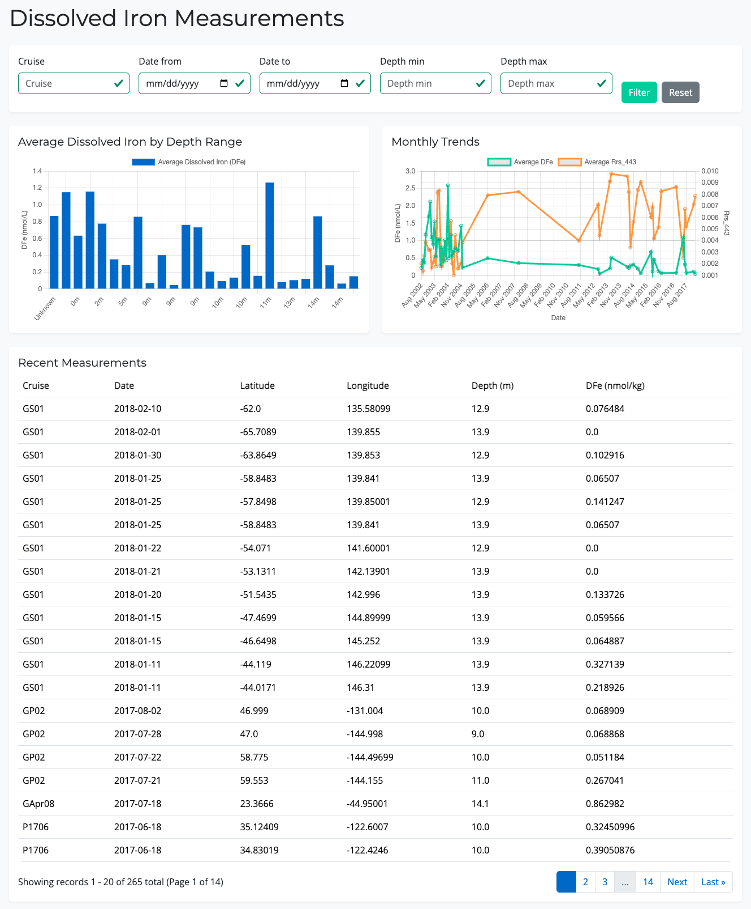
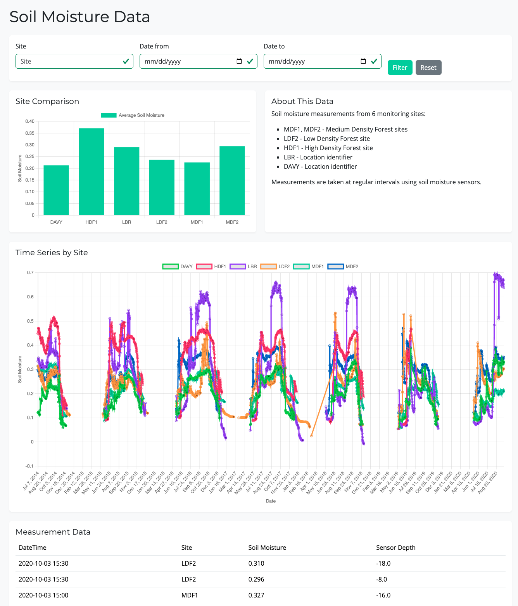
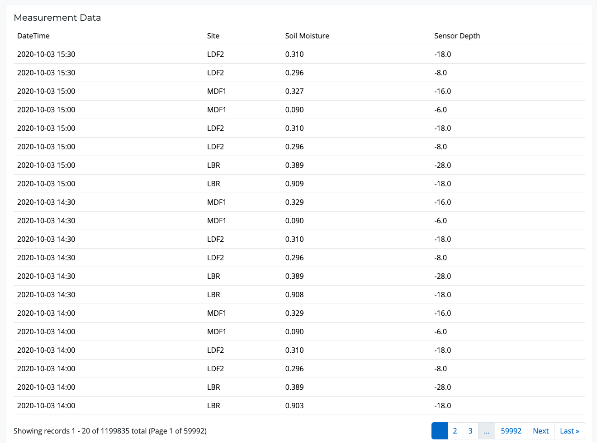

# Ocean Analytics Dashboard

A Django-based dashboard for visualizing and analyzing oceanographic and soil moisture data. The application provides interactive visualizations of dissolved iron measurements in ocean waters and soil moisture readings from various forest sites.

## 📊 Overview

This application serves two main purposes:
1. Visualize and analyze dissolved iron (DFe) measurements across different ocean locations, depths, and time periods
2. Track soil moisture levels across different forest density sites (MDF, LDF, HDF) over time

Key features:
- Interactive time series visualizations
- Data filtering capabilities
- Paginated data tables
- User authentication system
- Admin interface for data management

## 🚀 Setup and Installation

### Prerequisites

- Python 3.9+
- pip
- virtualenv
- SQLite3

### Installation Steps

1. Clone the repository
```bash
git clone https://github.com/esoteric-git/django-app.git
cd django-app
```

2. Create and activate virtual environment
```bash
python -m venv venv
# On Windows
venv\Scripts\activate
# On macOS/Linux
source venv/bin/activate
```

3. Install dependencies
```bash
pip install -r requirements.txt
```

4. Create .env file in project root
```
DJANGO_SECRET_KEY=your-secret-key
DJANGO_DEBUG=True
DJANGO_ALLOWED_HOSTS=localhost,127.0.0.1
```

5. Run migrations
```bash
python manage.py makemigrations
python manage.py migrate
```

6. Import data
```bash
python manage.py import_iron_data
python manage.py import_soil_moisture
```

7. Create superuser (optional, for admin access)
```bash
python manage.py createsuperuser
```

8. Run the development server
```bash
python manage.py runserver
```

Visit http://127.0.0.1:8000/ to view the dashboard.

## 🤔 Design Decisions & Assumptions

### Data Models
- **IronMeasurement**: Stores dissolved iron measurements with associated metadata (cruise, location, depth)
- **SoilMoisture**: Tracks soil moisture readings across different forest sites
- Both models include database indexes on frequently queried fields for performance

### Authentication
- Basic user authentication implemented for future access control
- Currently, most views are publicly accessible
- Admin interface requires authentication

### Performance Considerations
- Pagination implemented (20 items per page) to handle large datasets
- Database indexes on frequently filtered fields
- Efficient database queries using Django's ORM
- Chart data aggregated at the database level

### Data Import
- Custom management commands for importing CSV data
- Handles missing values and data validation
- Bulk create operations for efficient imports

### Frontend
- Bootstrap 5 for responsive design
- Chart.js for interactive visualizations
- Client-side date formatting for consistent display

## 📁 Project Structure

```
ocean_analytics/
├── dashboard/                 # Main application
│   ├── management/           # Custom management commands
│   ├── migrations/          # Database migrations
│   ├── templates/          # HTML templates
│   ├── models.py          # Database models
│   ├── views.py          # View logic
│   └── forms.py         # Form definitions
├── ocean_analytics/        # Project settings
└── data_src/             # Source data files
```

## 🔄 Data Refresh

To update the data:
1. Place new CSV files in the data_src directory
2. Run the import commands:
```bash
python manage.py import_iron_data
python manage.py import_soil_moisture
```

## 🤔 Assumptions

### Data Structure and Format
1. Dissolved Iron Dataset:
   - Small dataset (~265 rows)
   - Contains columns: cruise, datetime, lat, lon, depth, dfe, rrs_443
   - Primary metric of interest is Rrs_443 over time
   - Depth values are meaningful for analysis
   - Cruise identifiers are useful for filtering

2. Soil Moisture Dataset:
   - Large dataset (~1.2M rows, ~544MB)
   - Contains columns: timestamp, year, doy, hour, minute, site, m_soil, sensorZ
   - Data organized by monitoring sites (e.g., MDF1, MDF2, LDF2)
   - Timestamps can be constructed from year, doy (day of year), hour, and minute
   - Missing values are possible and should be handled gracefully

### Performance and Scaling
1. Data Loading:
   - Soil moisture data requires chunked processing due to size
   - 5000 records per chunk is optimal for memory usage
   - Bulk create operations with 1000 records per batch
   - Garbage collection needed between chunks

2. Data Display:
   - 20 records per page is sufficient for iron measurements
   - 50 records per page is appropriate for soil moisture
   - Charts can effectively display up to 1000 data points
   - Time-based aggregation needed for meaningful visualizations

### Security and Access
1. Authentication:
   - All data views require user authentication
   - Admin interface needed for data management
   - Basic user roles (admin/non-admin) are sufficient
   - No sensitive personal data in datasets

### Visualization Requirements
1. Iron Measurements:
   - Line charts best represent Rrs_443 trends
   - Additional visualizations for depth ranges and monthly trends
   - Filtering by cruise, date range, and depth is sufficient

2. Soil Moisture:
   - Both time series and site comparison views needed
   - Daily aggregation appropriate for trend analysis
   - Site-based comparisons are valuable
   - Filtering by site and date range meets user needs

### Technical Environment
1. Database:
   - SQLite sufficient for development
   - Indexes needed on datetime, site, and cruise fields
   - Database can handle the full dataset size

2. Browser Support:
   - Modern browsers with Chart.js support
   - JavaScript enabled
   - Responsive design required for various screen sizes

These assumptions guided the implementation decisions and may need to be revisited as requirements evolve or usage patterns emerge.

## 📸 Screenshots

### Dissolved Iron Dashboard Page

*Interactive visualization of dissolved iron measurements with filtering options*

### Soil Moisture Dashboard Page Charts

*Time series analysis of soil moisture data across different sites*

### Soil Moisture Analysis

*Paginated data tables with sorting and filtering capabilities*

